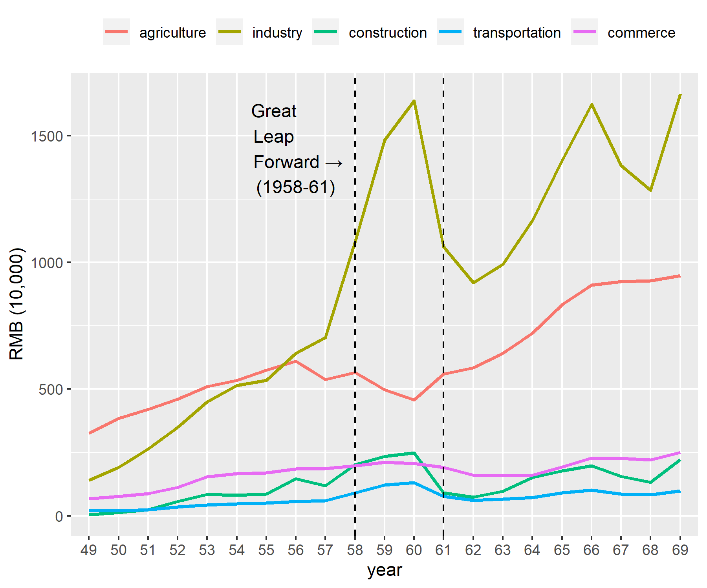

---?color=linear-gradient(180deg, white 75%, black 25%)
@snap[north-west h2-#5384AD span-50]
## Great Leap Legacy 
###  Development of Modern China
@snapend

@snap[north-east span-40]
####  University of Victoria 
#### Oct. 31, 2019
@snapend

@snap[south span-100 text-white]
Elizabeth Gooch, Naval Postgraduate School 
@snapend

---?color=linear-gradient(90deg, #5384AD 65%, white 35%)
@title[Steel works]

@snap[north-west h4-white h5-white span-40]
#### Great Leap Forward (1958-61) 
##### Steel production
@snapend

@snap[west span-55]
@quote[We and ore together make steel!](circa 1959)
@snapend

@snap[east span-45]
@img[shadow](assets/img/chinesepostersnet_weoresteel.jpg)
@snapend

---?color=#5384AD
@title[Spike in industrial output]

@snap[north span-90]
@img[shadow](assets/img/production.png)
@snapend

---?color=linear-gradient(90deg, #5384AD 65%, white 35%)
@title[Farming]

@snap[north-west h4-white h5-white span-40]
#### Great Leap Forward (1958-61) 
##### Farming and harvests
@snapend

@snap[south span-55]
@quote[The future of the rural village](circa 1959)
@snapend

@snap[north-east span-45]
@img[shadow](assets/img/chinesepostersnet_ruralfuture.jpg)
@snapend

---?color=linear-gradient(90deg, #5384AD 65%, white 35%)
@title[Communes]

@snap[north-west h4-white h5-white span-40]
#### Great Leap Forward (1958-61) 
##### People's Commune 
@snapend

@snap[south span-55]
@quote[The People's Communes are good](circa 1959)
@snapend

@snap[north-east span-45]
@img[shadow](assets/img/chinesepostersnet_communesgood.jpg)
@snapend

---?color=linear-gradient(90deg, #5384AD 65%, white 35%)
@title[Dams]

@snap[north-west h4-white h5-white span-40]
#### Great Leap Forward (1958-61) 
##### Labor mobilization
@snapend

@snap[east span-55]
@img[shadow](assets/img/dams.png)
@snapend

---?color=linear-gradient(90deg, #5384AD 65%, white 35%)
@title[Canteens]

@snap[north-west h4-white h5-white span-40]
#### Great Leap Forward (1958-61) 
##### Canteens on People's Communes 
@snapend

@snap[south span-55]
@quote[The commune's canteen is powerful, the dishes are deliciously made. You eat like you wish, production ambitions are rising](circa 1959)
@snapend

@snap[north-east span-45]
@img[shadow](assets/img/chinesepostersnet_canteens.jpg)
@snapend

---?color=#5384AD
@title[Toll on well-being]

@snap[north span-90]
@img[shadow](assets/img/popgrowthrate.png)
@snapend

---?color=linear-gradient(90deg, #5384AD 80%, white 20%)
@title[Motivating Question]

@snap[west h3-white span-95]
### How has the Great Leap affected long-term development in China?
@ul[list-spaced-bullets text-white text-09]
- What is the scale of the impact?
- In what ways did the Leap impact development?
- Who was most affected?
@ulend
@snapend

---
@title[Exogenous variation]
@snap[north span-75]
#### Empirical Framework
@math[span-45]
`\[
GDP_{2010} = GLF_j+r_i+GLF_j \times r_i
\]`
@mathend
@ul[list-spaced-bullets text-black]
- *GLF* is a proxy measure for *adventurism* at the provincial level
- *r* is geo-referenced terrain ruggedness for the district
- *GLF x r* is the exogenous term equivalent to the itention-to-treat effect
- province fixed effects
- covariates
- covariates interacted with the *GLF* 
@ulend
@snapend


---?color=linear-gradient(90deg, #5384AD 80%, white 20%)
@snap[west span-55]
#### How has the Great Leap affected long-term development?
@ul[list-spaced-bullets text-white text-09]
- Who was affected?
- How were they affected?
@ulend
@snapend

@snap[east span-45]
@img[shadow](assets/img/heatmap.png)
@snapend

---?color=linear-gradient(90deg, #5384AD 85%, white 15%)
@snap[west span-40]
@quote[It's what I do that defines me.](- circa 1959)
@snapend

@snap[east span-75]
@img[shadow](assets/img/chinesepostersnet_canteens.jpg))
@snapend

---?color=linear-gradient(180deg, white 75%, black 25%)
@title[Customize Slide Layout]

@snap[west span-50]
## Customize the Layout
@snapend

@snap[east span-50]

@snapend

@snap[south span-100 text-white]
Snap Layouts let you create custom slide designs directly within your markdown.
@snapend

---?color=linear-gradient(90deg, #5384AD 85%, white 15%)
@title[Motivating Question]

@snap[north-west h4-white]
#### Has Mao's Zedong...
@snapend

@snap[west span-55]
@ul[list-spaced-bullets text-white text-09]
- Who was affected?
- What is the transmission mechanism of the effect?
- *With a little imagination...*
- And **GitPitch Markdown**
@ulend
@snapend

@snap[east span-45]
@img[shadow](assets/img/heatmap.png)
@snapend

---?color=linear-gradient(90deg, #5384AD 65%, white 35%)
@title[Add A Little Imagination]

@snap[north-west h4-white]
#### And start presenting...
@snapend

@snap[west span-55]
@ul[list-spaced-bullets text-white text-09]
- You will be amazed
- What you can achieve
- *With a little imagination...*
- And **GitPitch Markdown**
@ulend
@snapend

@snap[east span-45]
@img[shadow](assets/img/heatmap.png)
@snapend

---

@snap[north-east span-100 text-pink text-06]
Let your code do the talking!
@snapend

```sql zoom-18
CREATE TABLE "topic" (
    "id" serial NOT NULL PRIMARY KEY,
    "forum_id" integer NOT NULL,
    "subject" varchar(255) NOT NULL
);
ALTER TABLE "topic"
ADD CONSTRAINT forum_id
FOREIGN KEY ("forum_id")
REFERENCES "forum" ("id");
```

@snap[south span-100 text-gray text-08]
@[1-5](You can step-and-ZOOM into fenced-code blocks, source files, and Github GIST.)
@[6,7, zoom-13](Using GitPitch live code presenting with optional annotations.)
@[8-9, zoom-12](This means no more switching between your slide deck and IDE on stage.)
@snapend


---?image=assets/img/adventurism.png

@snap[north span-100 h2-white]
## Now It's Your Turn
@snapend

@snap[south span-100 text-06]
[Click here to jump straight into the interactive feature guides in the GitPitch Docs @fa[external-link]](https://gitpitch.com/docs/getting-started/tutorial/)
@snapend
